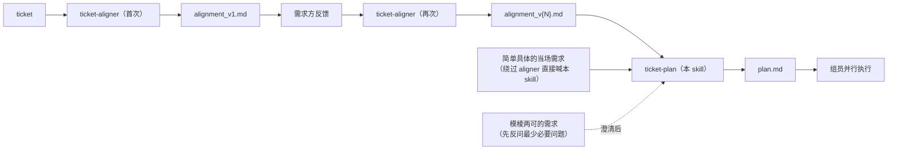
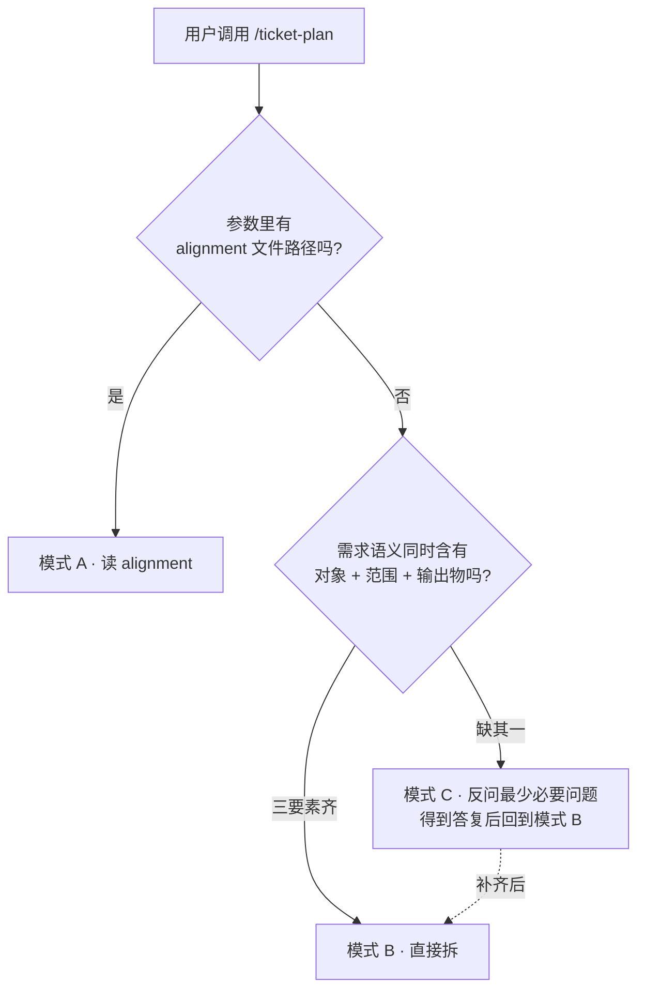
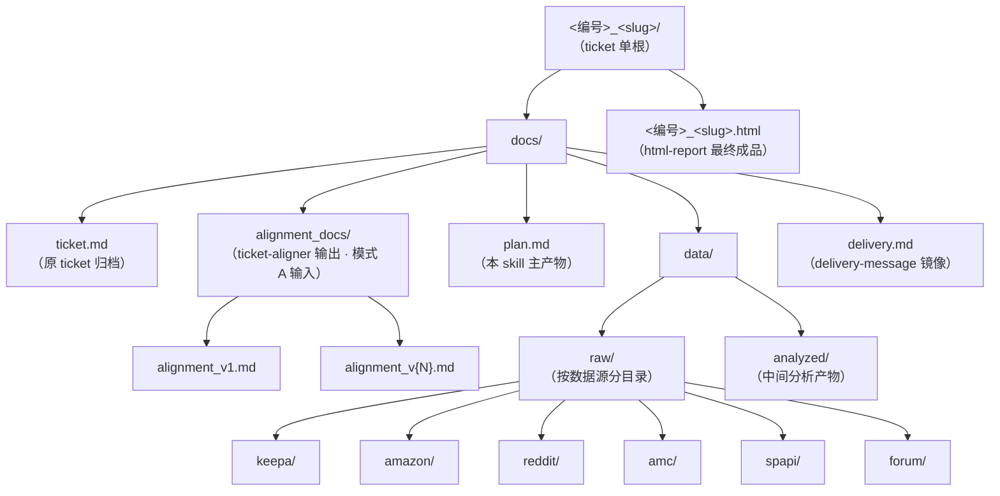
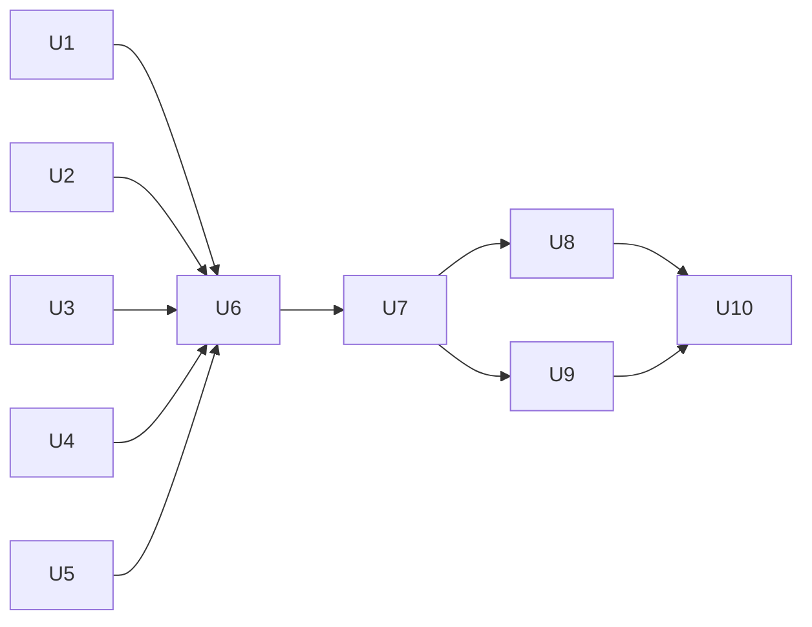

# ticket-plan — 对内执行 Plan 生成器

把"已对齐的需求"或"简单具体的当场需求"拆成"组员可抢单的工作单元"。每个单元 ≤ 8h、有 DoD、有工具、有依赖、不带人名分配。

整套数据组 ticket 处理 pipeline：



---

## 触发模式判定（三段式：清单 / 判断 / 反模式）

`ticket-plan` **不**强制走 alignment 这条单一路径。基于用户输入特征选模式：



### 清单：三要素

判定一个直接需求是否"简单且具体"，看是否同时含：

1. **对象**：什么产品 / 什么品类 / 什么活动 / 什么市场
2. **范围**：哪个时间窗 / 哪些维度 / 哪些数据源
3. **输出物**：占比表 / 趋势图 / 摘要 / 完整报告

### 判断（推荐而非默认）

| 用户输入特征 | 推荐模式 | 理由 |
|---|---|---|
| 提供了具体 alignment 文件路径 | **A** | 范围已锁定，直接读最权威源 |
| 一句话同时含产品 + 市场 + 时间窗 + 输出物 | **B** | 信息量足够拆 plan，强行 aligner 会拖时 |
| 涉及多市场 / 多产品 + 跨部门埋点 / 大于 ~24h 工时 | **A**（先建议跑 aligner） | 需要需求方确认范围避免返工 |
| 缺市场 / 缺时间窗 / 缺输出物形式 | **C**（反问最少必要） | 问 1–3 个最缺的，不走全套 aligner 8 章节 |
| 输出物是 LIVE 看板 / 工具 / Dashboard | **A** + 拆分立项提示 | 工具开发不在本 skill 范围 |
| 用户句末带"快速看一下""粗算""扫一眼" | **B** + 单档简化 | 不出"急/精"两档；plan 章节 4–7 可压缩 |

### 反模式

- ❌ "用户没给 alignment 一律先回去跑 aligner" —— 把简单需求拖成全流程
- ❌ "用户一句话就拆，不管缺什么口径" —— 漏关键维度返工
- ❌ "走模式 C 时把 aligner 8 章节问全套" —— 模式 C 只问 1–3 条最缺项
- ❌ "把模式 B 的 plan 也写满 7 章节" —— 简单需求出 4–5 章节即可

### 触发示例（三类各 ≥ 1 例）

```text
# 模式 A — 有 alignment 报告
/ticket-plan ./66_Manual-SFT1200-Translation-FR-DE-ES-PL/docs/alignment_docs/alignment_v2.md

# 模式 B — 直接简单需求
/ticket-plan BE9300 在美国市场过去 12 个月的销量占比 → 输出占比表 + 趋势图
/ticket-plan 复盘 2026 Q1 Prime Day 活动效果 → DE / UK / US 三市场的归因 csv
/ticket-plan Flint4 vs ASUS RT-BE92U 价格分布对比（US 市场，Keepa 30 天历史）→ HTML 报告

# 模式 C — 模棱两可（→ 本 skill 反问最少必要问题）
/ticket-plan 看一下竞品           → 反问：哪个产品/品类？哪个市场？要什么输出？
/ticket-plan 算一下 ROI           → 反问：什么活动 / 时间窗？哪个市场？预算粒度？
/ticket-plan 用户怎么看 USB-C 接口 → 反问：哪些机型？哪些数据源（评论/论坛）？
```

---

## 怎么用（团队成员视角）

skill 通过 `data-team-skills` marketplace 自动同步。在 Claude Code 会话里**显式**触发：

| 触发方式 | 示例输入 |
|---|---|
| Slash 命令 | `/data-team-skills:ticket-plan` |
| `@` 引用 | `@ticket-plan 拆这个 ticket 的 Plan` |
| `/skill` 命令 | `/skill ticket-plan` |

触发后按"模式判定 → 输入捕获 → 生成 plan → 落盘"四步走，详见下方工作流。

---

## 核心契约（Rev 3 · 不要违反）

1. **三模式独立可触发** —— 模式 A / B / C 任一都是合法入口；**不**强制把 B / C 退回到模式 A 走完整 aligner。模式 C 反问后用户答复即进入 B
2. **模式 A 必须以最新 alignment_v{N}.md 为 source of truth**（N 取目录里最大值）—— 不得绕过最新 vN 直接拆 ticket
3. **模式 B / C 工时估算保守化** —— 没经过 aligner 双档评估，工时给"约 Xh ± 20%"区间且明示"未经需求方对齐"
4. **每个工作单元 ≤ 8h** —— 超过就按维度（市场 / 关键词 / 章节）拆；下限 0.5h，低于不值得单列
5. **每个工作单元都有完整字段**：编号 / 单元名 / 输入 / 输出产物 / 预计耗时（h）/ 推荐工具 / 依赖 / 可并行兄弟 / DoD / 风险点。**没有 DoD 的 U 不算合格输出**
6. **依赖图无环** —— 检查 U 之间的依赖图，发现环立即报错
7. **不分配具体人名**（"@张三 接 U1"）—— skill 只列单元，分配在 IM 抢单或会上敲定
8. **模式 A 下工时与最新 alignment_v{N}.md 第三章选定档一致**（容差 ±10%）—— 不一致**不得**自行抹平，停下报错让用户重审
9. **U 必须基于 work_unit_patterns.md 的 P1–P14 模板** —— 没合适 pattern 的自由格式 U，基线必须标 `（耗时待估）`
10. **plan.md 工时全用小时 h** —— 与 capabilities.md / alignment 单位一致；不混用工作日 / 天 / 半天
11. **图表统一用 mermaid** —— 流程图 / 依赖图 / 时间线 / ER 一律用 mermaid code block；mermaid 不支持的图类型见下方"图表白名单"
12. **所有产物在 `<编号>_<slug>/` 单根目录下** —— 详见下方"产物路径约定"，禁止落到 `data/raw/<source>/<编号>/` 这种 ticket 根目录之外的散落路径

---

## 产物路径约定（关键 · 单根目录）

所有产物落在 `<编号>_<slug>/` 这个 **ticket 单根目录**下，与 ticket-aligner、html-report、delivery-message、social-reviews-analyzer 等同根。**不**再使用 `data/raw/<source>/<编号>/`、`data/analyzed/<编号>/` 这种把数据散落到项目其他位置的旧约定。

### 完整目录结构（正式定稿）



实际目录树形态：

```text
<编号>_<slug>/                                        ← ticket 单根
├── docs/                                             ← 过程性文档
│   ├── ticket.md                                     ← 原 ticket（aligner 落盘）
│   ├── alignment_docs/                               ← 模式 A 输入（可选）
│   │   ├── alignment_v1.md
│   │   └── alignment_v{N}.md
│   ├── plan.md                                       ← 本 skill 主产物
│   ├── data/
│   │   ├── raw/                                      ← 各数据源原始数据
│   │   │   ├── keepa/
│   │   │   │   └── <descriptor>_<YYYYMMDD>.<ext>
│   │   │   ├── amazon/
│   │   │   ├── reddit/
│   │   │   ├── amc/
│   │   │   ├── spapi/
│   │   │   └── forum/<source>/                       ← forum 二级分（glinet/openwrt/...）
│   │   └── analyzed/                                 ← 中间分析产物
│   │       └── <descriptor>_<YYYYMMDD>.<ext>
│   └── delivery.md                                   ← delivery-message 镜像
└── <编号>_<slug>.html                                ← html-report 最终交付物
```

**为什么 plan.md 在 `docs/` 下而不是 ticket 根**：`docs/` 下都是组内过程材料；ticket 根只放对外可发的成品（HTML）。这是 README "过程 vs 成品 用文件位置区分" 设计哲学的延续。

### 文件命名规则

每个原始 / 分析产物用统一格式：

```text
<descriptor>_<YYYYMMDD>.<ext>
```

- `<descriptor>`：单一短语描述本文件内容，仅用 `_` 连接，**不**含 `/ \ : * ? " < > |`
- `<YYYYMMDD>`：抓取 / 生成日期
- `<ext>`：`csv` / `json` / `xlsx` / `parquet` 等

枚举型维度（市场、关键词、ASIN）的处理：

| 数量 | 推荐做法 | 示例 |
|---|---|---|
| 单一值 | 拼进 descriptor | `keepa_top100_us_20260429.json` |
| 2–4 个 | 单独按值拆文件 | `keepa_top100_us_20260429.json` + `keepa_top100_de_20260429.json` |
| ≥ 5 个 | 用 `multi` 标记 + 同目录 `_manifest.csv` 列清单 | `keepa_top100_multi_20260429.json` + `keepa_top100_multi_20260429_manifest.csv` |

### 正确路径示例（≥ 3）

```text
56_Market-Capacity-EU/docs/data/raw/keepa/keepa_top100_de_20260429.json
56_Market-Capacity-EU/docs/data/raw/keepa/keepa_top100_multi_20260429.json
56_Market-Capacity-EU/docs/data/raw/amazon/amazon_reviews_be9300_us_20260429.csv
56_Market-Capacity-EU/docs/data/analyzed/price_band_share_10country_20260429.csv
56_Market-Capacity-EU/docs/data/analyzed/yoy_growth_10country_20260429.csv
```

### 反模式（禁止 · ≥ 3）

```text
# ❌ 反模式 1 · 散落到 ticket 根目录之外
data/raw/keepa/56/keepa_top100_DE_20260429.json
                                          ↑↑ 数据落到项目根的 data/，不在 ticket 单根下

# ❌ 反模式 2 · 文件名里出现 / 字符（被文件系统当目录分隔符）
data/raw/keepa/56/keepa_top100_FR/IT/ES_20260429.json
                                ↑    ↑
                                这两个 / 会创建 IT 和 ES 两层子目录，文件实际写不进去

# ❌ 反模式 3 · 国家代码列表硬编码进文件名
analyzed/56/price_band_share_DE_FR_IT_ES_PL_NL_BE_AT_SE_DK_20260429.csv
                            ↑
                            10 国扩到 15 国时文件名要改两遍 → 用 `multi` + manifest

# ❌ 反模式 4 · 按工时档拆目录
56_X/docs/data/精准版/ ...
            ↑ 中文 / 状态字段不进路径；档位差异在 plan.md 里说明

# ❌ 反模式 5 · 在 ticket 单根之外另建 ticket 元目录
data/analyzed/56_X/yoy_growth_20260429.csv
↑ 与统一约定冲突；正确路径是 56_X/docs/data/analyzed/yoy_growth_20260429.csv
```

---

## 工作流（用户触发后按序执行）

### Step 1 — 模式判定 + 输入捕获

```bash
# 解析参数
ARG="$1"

if [ -f "$ARG" ] && grep -qE 'alignment_v[0-9]+\.md$' <<< "$ARG"; then
    MODE=A    # 提供了 alignment 文件路径
elif [ -n "$ARG" ]; then
    MODE=B_or_C  # 直接需求，进入"三要素"判定
else
    # 没参数 → 提问
    MODE=C
fi
```

**模式 A**（alignment 路径给定）：

```bash
# 1. 用 ticket 编号定位 ticket 目录（由 alignment 路径反推）
TICKET_DIR=$(echo "$ARG" | sed -E 's|/docs/alignment_docs/.*||')

# 2. 找最新 alignment 版本（用户给的是 v2，但 v3 已存在时仍取最新）
LATEST=$(ls "$TICKET_DIR/docs/alignment_docs/"alignment_v*.md 2>/dev/null \
         | sort -V \
         | tail -n 1)

# 3. 读最新版作为 source of truth
Read "$LATEST"
```

模式 A 前置检查（参考旧 ticket-decomposer Rev 2 契约 1, 8）：仍要求 alignment_vN N≥2 且第三章选定单档；不满足时建议跑 aligner 反馈轮次。

**模式 B**（直接需求 · 三要素齐）：

读取需求字符串，提取：对象 / 范围 / 输出物。直接进 Step 2。

**模式 C**（模棱两可 · 反问最少必要）：

```text
为了拆 plan，我需要确认 1–3 个最缺项（不走完整 aligner 流程）：

1. {缺哪一项就问哪一项，按顺序问对象 → 范围 → 输出物}

回复后我直接进入 plan 生成。
```

注意：模式 C **绝不**问 aligner 风格的 8 章节式确认问题（"急 vs 精"档位 / "您来定，建议 X" / 8 章节范围说明等不出现）。问到能拆为止，多余不问。

### Step 2 — 读 capabilities.md（共享单源）

```bash
Read ../ticket-aligner/references/capabilities.md
```

加载工时基线 + 可行性锚点。模式 A 下保证与 alignment 工时同源；模式 B / C 下作为工具 / 工时估算的基线。

### Step 3 — 读 decomposition_recipes.md

```bash
Read references/decomposition_recipes.md
```

按需求类型匹配配方。多类别 → 取并集 + 去重。模式 B / C 下从需求语义里推断类型分类。

### Step 4 — 读 work_unit_patterns.md

```bash
Read references/work_unit_patterns.md
```

加载 14 个 U-pattern 模板，作为生成 U 清单的填空池。

### Step 5 — 生成对内 Plan 文档

固定章节结构（模式 A 出全 7 章；模式 B / C 可压到 5 章，省略章节 6 / 7 中纯仪式部分）：

#### 顶层元信息

```text
# 需求 {ticket_id 或 临时编号} 对内执行 Plan

- **ticket 标题**：{从 alignment / 需求字符串引用}
- **触发模式**：A · 来自 alignment_v{N}.md / B · 直接需求 / C · 反问后直接需求
- **alignment 版本**（仅 A）：v{N}（基于：{文件路径}）
- **类型分类**：{用户研究 / 竞品分析 / 市场容量 / ...}
- **生成时间**：{YYYY-MM-DD HH:MM}
- **基于 capabilities.md 版本**：{version}
- **状态**：v1（首次拆分）
```

#### 章节 1：锁定的需求范围

- 模式 A：从 alignment 第二/三/五/六章提一段摘要（≤ 5 句）
- 模式 B：从用户原句反推业务级数据源 + 具体维度 + deliverable
- 模式 C：合并反问答复后形成最小必要范围摘要

#### 章节 2：拆分思路

引用 `decomposition_recipes.md` 的"四步流程"框架；说明本 ticket 选了哪些配方、为什么。多类别合并的去重 / 并集逻辑也在这里讲清楚。

#### 章节 3：工作单元清单

每个 U 一小节：

```text
### U{编号}. {单元名}

- **输入**：{...}
- **输出产物**：{<编号>_<slug>/docs/data/... 的具体相对路径}
- **预计耗时**：{Xh}
- **推荐工具**：{...}
- **基于 P-pattern**：{P1–P14 中的某个，或"自定义"+ 标注耗时待估}
- **依赖**：{U 编号清单 / "无"}
- **可并行兄弟**：{U 编号清单}
- **DoD**：
  - {验收点 1}
  - {验收点 2}
- **风险**：{...}
```

#### 章节 4：依赖图（mermaid · flowchart）

强制 mermaid。例：

````markdown

````

环检查：✅ 无环。

#### 章节 5：工期估算

```text
- **1 人串行**：Σ(所有 U) = {Xh}
- **2 人并行（典型）**：关键路径 = {Xh}
- **N 人最大并行（理论下限）**：{Xh}（N = {建议数}）
```

模式 A：与 alignment 第 6 章 MVP 总 h 偏差 > ±10% 时输出 `⚠️ 工时不一致警告`，**不**自行抹平。
模式 B / C：注明"未经需求方对齐，工时区间为 ±20%"。

#### 章节 6：里程碑 + DoD

整体交付物与验收标准。模式 A 呼应 alignment 第 6 章 MVP 承诺；模式 B / C 自定义里程碑（通常 2–3 个即可，按"数据收集 → 分析完成 → deliverable 完成"分）。

#### 章节 7：风险登记

| 风险类型 | 触发的 U | 缓解措施 |
|---|---|---|
| 凭证依赖 | U_AMC, U_SPAPI | 抢单前 30 分钟内验证凭证 |
| 限流 | U_Reddit | 每批 ≤ 5 关键词 |
| ... | ... | ... |

模式 B / C 下仅列 ≤ 3 条最关键风险；不强凑表格。

### Step 6 — 落盘

```bash
Write <编号>_<slug>/docs/plan.md
```

模式 A：`<编号>_<slug>/` 来自用户给的 alignment 路径所在 ticket 目录，已存在。
模式 B / C：

- 用户**有**给编号（如 `/ticket-plan 56 BE9300 在美国市场的占比`）→ ticket 目录 `56_<slug>` 由本 skill 创建（slug 从需求语义派生）
- 用户**没**给编号 → 用临时编号 `tmp-YYYYMMDD-HHMM` + slug，落盘到 `tmp-YYYYMMDD-HHMM_<slug>/docs/plan.md`，并在终端提示"建议用真实编号重命名目录或重跑 aligner 锁定编号"

完成后在对话里**简短**告知文件路径 + 章节 5 工期估算摘要 + 章节 7 关键风险（≤ 3 条）。**不要**把整份文档复读到对话里。

---

## 反模式（Rev 3 · 这些情况不要做）

- ❌ 触发条件放宽到自然语言 —— 仅显式 slash / @ 命令
- ❌ 模式 B / C 也强行问 aligner 风格的 8 章节式确认问题（"急 vs 精"档位 / "D) 您来定" 兜底等）—— 模式 C 只问 1–3 条最缺项
- ❌ 模式 B / C 工时不打"未经对齐 ±20%" 标记 —— 误导组员把临时估算当承诺
- ❌ 模式 A 下绕过最新 alignment_v{N}.md 直接读 ticket 拆分 —— alignment 是 source of truth
- ❌ 模式 A 下 alignment 与用户对话中说法冲突时自行调整 —— 必须停下让用户出 alignment_v{N+1}
- ❌ 工时与 alignment 选定档不一致时自行抹平（模式 A）—— 报错并提示用户重审
- ❌ plan.md 出现"工作日 / 天 / 半天"作为工时单位 —— 全文统一用 h
- ❌ 单 U > 8h —— 必须按维度再拆
- ❌ 单 U 缺 DoD —— 不合格
- ❌ 依赖图成环 —— 报错
- ❌ 给单元强行配人名 —— 只列单元
- ❌ 工具开发类需求强行做完整 7 章节 Plan —— 提示拆分立项
- ❌ 在最终回复里把整份文档复读 —— 已落盘，给路径即可
- ❌ 用 ASCII 框图画依赖图 —— 强制 mermaid，便于 html-report 直接复用
- ❌ 文件落到 `data/raw/<source>/<编号>/` 这种项目根 data/ 下 —— 必须在 `<编号>_<slug>/docs/data/...`
- ❌ 文件名里用 `/` 当国家分隔符（`top100_FR/IT/ES.json`）—— 用 `_multi` + manifest

---

## 图表白名单（mermaid 不支持时的例外）

`SKILL.md` / `references/*.md` / `assets/example_*.md` 中**所有**结构示意图一律 mermaid。仅以下图类型允许例外（必须在文档里登记原因）：

| 图类型 | mermaid 支持？ | 替代 |
|---|---|---|
| 流程图 / 工作流 | ✅ flowchart | — |
| 任务依赖 | ✅ flowchart | — |
| 时间线 / 甘特 | ✅ gantt | — |
| 时序 | ✅ sequenceDiagram | — |
| ER 实体关系 | ✅ erDiagram | — |
| 状态机 | ✅ stateDiagram-v2 | — |
| 类图 | ✅ classDiagram | — |
| 饼图（小型） | ✅ pie | — |
| 桑基图 | ❌ | ECharts / Plotly |
| 雷达图 | ❌ | ECharts |
| 地理热力 | ❌ | Leaflet / ECharts |
| 散点矩阵 | ❌ | matplotlib / plotly |

例外图类型由 `html-report` skill 处理，**不**在 plan.md / SKILL.md 中。

---

## 文件结构

```text
skills/ticket-plan/
├── SKILL.md                       # 你正在读的这个文件
├── references/
│   ├── decomposition_recipes.md   # 10 类 ticket 各自的拆分配方
│   └── work_unit_patterns.md      # 14 个 U-pattern 模板
└── assets/
    └── example_BE7200_plan.md     # 与 ticket-aligner 同 ticket 的下游 Plan 示例

# 共享文件（不在本 skill 目录内）：
../ticket-aligner/references/capabilities.md   # 单源工时基线
```

---

## 一句话工作流摘要

> 解析参数 → 三模式判定（A 有 alignment / B 三要素齐 / C 反问 1–3 条最缺项）→ 读 capabilities + recipes + patterns → 按 5 / 7 章节骨架填，工时与 alignment 一致 ±10%（模式 A）或标 ±20% 未经对齐（模式 B / C）→ 依赖图用 mermaid 且无环 → 产物路径全在 `<编号>_<slug>/docs/data/{raw/<source>,analyzed}/` 单根下 → 落盘 `<编号>_<slug>/docs/plan.md` → 在对话里给路径 + 工期摘要 + Top 3 风险。
