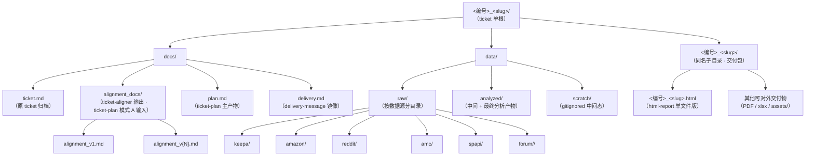

# Ticket 产物路径约定（5 skill 共享 · 单一来源）

> 本文是 GL.iNet 数据组 ticket 产物目录约定的**唯一权威定义**。
> README.md / ticket-aligner / ticket-plan / html-report / social-reviews-analyzer / delivery-message 6 处描述都引用本文，不再各自重述。
> 路径约定要变更时，**只改这一份**，让其他 skill 自动同步。

---

## 1. 设计哲学：三层关注点分离

每个 ticket 是一个 `<编号>_<slug>/` 单根目录（编号由 ticket-aligner 创建时定型；slug 是 kebab-case 标题）。该单根下有**三个并列子目录**，分别承担不同读者的需求：

| 子目录                     | 读者          | 内容                                                       |
| -------------------------- | ------------- | ---------------------------------------------------------- |
| `docs/`                    | 人（组内）    | 过程材料：原 ticket、对齐稿、plan、交付消息归档            |
| `data/`                    | 机器（分析）  | 数据资产：原始抓取、分析产物、流水线中间态                 |
| `<编号>_<slug>/`（同名子目录）| 人（需求方）  | 对外交付包：HTML 报告、PDF、xlsx、附件 assets / data 切片 |

**为什么要三层分离**：

1. **交付时不误打**：组员要给需求方发结果时，zip 同名子目录即可，不会把过程材料（`docs/`）和分析数据（`data/`）误打进交付包
2. **读写分离清楚**：人读的、机器写的、对外发的各占一层，跨成员交接 ticket 时一眼分清
3. **plan.md 不外泄**：plan 留在 `docs/` 而非交付包子目录里——内部 plan 不应该出现在发给需求方的 zip 里，这是有意设计

---

## 2. 完整目录结构

### Mermaid 流程图（供 html-report 复用）



### 实际目录树形态

```text
<编号>_<slug>/                                        ← ticket 单根
├── docs/                                             ← 过程性文档（人类阅读）
│   ├── ticket.md                                     ← 原 ticket（aligner 落盘）
│   ├── alignment_docs/                               ← ticket-plan 模式 A 输入（可选）
│   │   ├── alignment_v1.md
│   │   └── alignment_v{N}.md
│   ├── plan.md                                       ← ticket-plan 主产物
│   └── delivery.md                                   ← delivery-message 镜像
├── data/                                             ← 数据资产（机器分析）
│   ├── raw/                                          ← 各数据源原始数据
│   │   ├── keepa/
│   │   │   └── <descriptor>_<YYYYMMDD>.<ext>
│   │   ├── amazon/
│   │   ├── reddit/
│   │   ├── amc/
│   │   ├── spapi/
│   │   └── forum/<source>/                           ← forum 二级分（glinet / openwrt / …）
│   ├── analyzed/                                     ← 中间 + 最终分析产物
│   │   └── <descriptor>_<YYYYMMDD>.<ext>
│   └── scratch/                                      ← gitignored 流水线中间态
└── <编号>_<slug>/                                    ← 交付包子目录（同名）
    ├── <编号>_<slug>.html                            ← html-report 单文件版（默认）
    └── ...                                           ← 其他可交付物（PDF / xlsx / assets/ / data/ JSON 切片）
```

---

## 3. `data/` 三类子目录

| 子目录            | 角色                                          | git 跟踪 | 写入方                          |
| ----------------- | --------------------------------------------- | -------- | ------------------------------- |
| `data/raw/`       | 原始抓取（按数据源分目录）                    | ✅       | 数据采集脚本 / Apify / 抓取工具 |
| `data/analyzed/`  | 分析结果（含 social-reviews-analyzer merged CSV）| ✅       | 分析脚本 / social-reviews-analyzer |
| `data/scratch/`   | 流水线中间态（jsonl + 日志）                  | ❌       | social-reviews-analyzer 等流水线 |

**重要**：`scratch/` 是 `raw/` `analyzed/` 之外的**第三个并列子目录**，不是 `analyzed/` 的子目录、也不是 `raw/` 的子目录。它专门承载可重新生成的中间产物，不进 git、不参与对外交付。

---

## 4. 文件命名规则

每个原始 / 分析产物用统一格式：

```text
<descriptor>_<YYYYMMDD>.<ext>
```

- `<descriptor>`：单一短语描述本文件内容，仅用 `_` 连接，**不**含 `/ \ : * ? " < > |`
- `<YYYYMMDD>`：抓取 / 生成日期（无分隔符）
- `<ext>`：`csv` / `json` / `xlsx` / `parquet` 等

枚举型维度（市场、关键词、ASIN）的处理：

| 数量    | 推荐做法                                       | 示例                                                                                |
| ------- | ---------------------------------------------- | ----------------------------------------------------------------------------------- |
| 单一值  | 拼进 descriptor                                | `keepa_top100_us_20260429.json`                                                     |
| 2–4 个  | 单独按值拆文件                                 | `keepa_top100_us_20260429.json` + `keepa_top100_de_20260429.json`                   |
| ≥ 5 个  | 用 `multi` 标记 + 同目录 `_manifest.csv` 列清单 | `keepa_top100_multi_20260429.json` + `keepa_top100_multi_20260429_manifest.csv`     |

---

## 5. 正确路径示例

```text
56_Market-Capacity-EU/data/raw/keepa/keepa_top100_de_20260429.json
56_Market-Capacity-EU/data/raw/keepa/keepa_top100_multi_20260429.json
56_Market-Capacity-EU/data/raw/amazon/amazon_reviews_be9300_us_20260429.csv
56_Market-Capacity-EU/data/analyzed/price_band_share_10country_20260429.csv
56_Market-Capacity-EU/data/analyzed/yoy_growth_10country_20260429.csv
56_Market-Capacity-EU/56_Market-Capacity-EU/56_Market-Capacity-EU.html
```

---

## 6. 反模式（禁止）

```text
# ❌ 反模式 1 · 数据散落到 ticket 根目录之外
data/raw/keepa/56/keepa_top100_de_20260429.json
                                          ↑↑ 数据落到项目根的 data/，不在 ticket 单根下

# ❌ 反模式 2 · 文件名里出现 / 字符（被文件系统当目录分隔符）
data/raw/keepa/56/keepa_top100_FR/IT/ES_20260429.json
                                ↑    ↑
                                这两个 / 会创建 IT 和 ES 两层子目录，文件实际写不进去

# ❌ 反模式 3 · 国家代码列表硬编码进文件名
analyzed/56/price_band_share_DE_FR_IT_ES_PL_NL_BE_AT_SE_DK_20260429.csv
                            ↑
                            10 国扩到 15 国时文件名要改两遍 → 用 `multi` + manifest

# ❌ 反模式 4 · 按工时档拆目录
56_X/data/精准版/ ...
            ↑ 中文 / 状态字段不进路径；档位差异在 plan.md 里说明

# ❌ 反模式 5 · 在 ticket 单根之外另建 ticket 元目录
data/analyzed/56_X/yoy_growth_20260429.csv
↑ 与统一约定冲突；正确路径是 56_X/data/analyzed/yoy_growth_20260429.csv

# ❌ 反模式 6 · HTML 报告落在 ticket 根（旧约定，已废弃）
56_X/56_X.html
↑ HTML 必须在交付包子目录下：56_X/56_X/56_X.html
```

---

## 7. 各 skill 在此约定下的角色

| Skill                       | 写入路径                                                | 读取路径                                              |
| --------------------------- | ------------------------------------------------------- | ----------------------------------------------------- |
| `ticket-aligner`            | `<root>/docs/ticket.md`、`<root>/docs/alignment_docs/alignment_v{N}.md` | —                                                     |
| `ticket-plan`               | `<root>/docs/plan.md`                                   | `<root>/docs/alignment_docs/alignment_v{N}.md`（模式 A）|
| `social-reviews-analyzer`   | `<root>/data/analyzed/<X>_reviews.csv`、`<root>/data/scratch/*.jsonl` | `<root>/data/raw/<source>/*` 或用户指定外部 CSV       |
| `html-report`               | `<root>/<root>/<root>.html` 或 `<root>/<root>/index.html` | `<root>/docs/plan.md`、`<root>/data/analyzed/*`         |
| `delivery-message`          | `<root>/docs/delivery.md`                               | 附件指引到 `<root>/<root>/`（不读其内容，只指引组员 zip）|

> 缩写：`<root>` = `<编号>_<slug>/`

---

## 8. 路径约定演进史（变更日志）

- **2026-05-07** · 三层目录拆分（PR #25）：`data/` 从 `docs/` 下提升到 ticket 根、HTML 从 ticket 根移到同名子目录作为「交付包」边界
- **2026-04-下旬** · 单根目录约定（PR #20）：所有产物落 `<编号>_<slug>/` 单根，废弃 `data/raw/<source>/<编号>/` 这种把数据散落到项目其他位置的旧约定

变更约定时请同步更新本文件 + 在此处追加一行（保留历史）。

---

## 9. 引用本文件的位置

> 这些位置应该都只是「指针」，不应该重复描述路径约定细节。

- `README.md` § 4-§ 5 ticket 产物章节
- `skills/ticket-plan/SKILL.md` § 产物路径约定
- `skills/ticket-aligner/SKILL.md` § 落盘约定
- `skills/html-report/SKILL.md` § 报告落盘
- `skills/social-reviews-analyzer/SKILL.md` § Step 3 default paths
- `skills/delivery-message/SKILL.md` § 变体 E 附件目录约定
- `skills/ticket-plan/assets/example_BE7200_plan.md`（不直接引用，但路径示例必须符合本文件 § 5）
